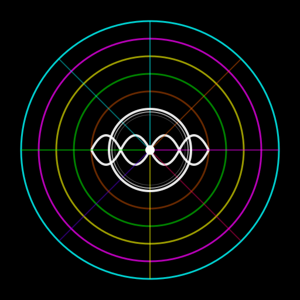

# 🌀 Cymatics - Sound Wave Art

[](LICENSE)
[](https://www.electronjs.org/)
[]()

Aplicação desktop para visualização de áudio em tempo real com animações psicodélicas e interativas.



## ✨ Recursos

### 6 Tipos de Visualizações

- **🌀 Psicodélica** - Múltiplas camadas rotativas com padrões caleidoscópicos
- **〰️ Onda Linear** - Visualização clássica de forma de onda com glow colorido
- **⭕ Circular Simples** - Onda circular pulsante com cores dinâmicas
- **📊 Barras de Frequência** - Equalizador visual estilo espectro
- **✨ Partículas** - Sistema de partículas que reage à amplitude do áudio
- **🖱️ Partículas Interativas** - Partículas conectadas que respondem ao mouse e ao som

### Características Técnicas

- ✅ Captura de áudio do sistema (loopback audio)
- ✅ Renderização em tempo real com Canvas API
- ✅ Análise de áudio com Web Audio API
- ✅ Interface minimalista e imersiva
- ✅ Controle via menu nativo da aplicação
- ✅ Suporte para tela cheia
- ✅ Cores HSL dinâmicas e efeitos de glow

## 🚀 Início Rápido

### Instalação

```bash
# Clone o repositório
git clone https://github.com/leonardorcamargo/cymatics.git
cd cymatics

# Instale as dependências
npm install

# Execute a aplicação
npm start
```

### Uso

1. **Inicie a aplicação** com `npm start`
2. **Clique no botão** "🎧 Capturar áudio do sistema"
3. **Selecione a fonte de áudio** (tela ou janela com áudio)
4. **Troque entre animações** usando o menu "Animações" no topo da janela

### Atalhos de Teclado

- **F11** - Alternar tela cheia
- **Ctrl+R** / **Cmd+R** - Recarregar aplicação
- **Ctrl+Shift+I** / **Cmd+Option+I** - Abrir DevTools

## 📦 Build

### Pré-requisitos

- Node.js 18+
- npm 9+

### Gerar Ícones

Converta manualmente o `build/icon.svg` para:
- PNG (512x512) para Linux
- ICO (múltiplos tamanhos) para Windows
- ICNS para macOS

### Build por Plataforma

```bash
# Linux (AppImage e .deb)
npm run build:linux

# Windows (instalador e portátil)
npm run build:win

# macOS (.dmg e .zip)
npm run build:mac

# Todas as plataformas
npm run build:all
```

Os arquivos gerados estarão em `dist/`

📖 Veja [BUILD.md](BUILD.md) para instruções detalhadas.

## 🏗️ Estrutura do Projeto

```
cymatics/
├── src/
│   ├── main.js           # Processo principal do Electron
│   ├── renderer.js       # Lógica de renderização e animações
│   ├── index.html        # Interface da aplicação
│   └── preload.js        # Script de pré-carregamento (opcional)
├── build/
│   ├── icon.svg          # Ícone vetorial
│   ├── icon.png          # Ícone para Linux
│   ├── icon.ico          # Ícone para Windows
│   ├── icon.icns         # Ícone para macOS
│   └── generate-icons.sh # Script para gerar ícones
├── package.json          # Configurações e dependências
├── BUILD.md              # Guia de build detalhado
└── README.md             # Este arquivo
```

## 🛠️ Tecnologias

- **[Electron](https://www.electronjs.org/)** 40+ - Framework para apps desktop
- **[Web Audio API](https://developer.mozilla.org/en-US/docs/Web/API/Web_Audio_API)** - Análise e processamento de áudio
- **[Canvas API](https://developer.mozilla.org/en-US/docs/Web/API/Canvas_API)** - Renderização 2D de alta performance
- **HTML5** / **CSS3** / **JavaScript** - Stack web moderna

## 🎨 Animações

### Psicodélica
Visualização com 6 camadas rotativas em padrão de caleidoscópio, cada uma com cores complementares e efeitos de glow. Rotação contínua e amplitude reativa.

### Onda Linear
Forma de onda clássica horizontal com cores HSL rotativas e efeito de rastro para movimento fluido.

### Circular Simples
Círculo pulsante que expande e contrai com a amplitude do áudio, com cores que transitam pelo espectro HSL.

### Barras de Frequência
Equalizador visual com barras verticais, cada uma representando uma faixa de frequência com gradiente de cores.

### Partículas
100 partículas que se movem com física simples (velocidade e bounce), com tamanho e velocidade modulados pela amplitude do áudio.

### Partículas Interativas
150 partículas conectadas por linhas, que:
- **Fogem do mouse** quando há som alto
- **São atraídas ao mouse** quando há silêncio
- **Retornam à posição base** com força elástica
- **Conectam-se** quando próximas (< 100px)
- **Brilham mais** perto do cursor

## 🐧 Notas Específicas por Plataforma

### Linux
- A aplicação requer `--no-sandbox` para funcionar corretamente
- Testado em Ubuntu 22.04+ e Arch Linux
- PulseAudio ou PipeWire necessário para captura de áudio

### Windows
- Requer Windows 10 ou superior
- A captura de áudio funciona com qualquer dispositivo de saída

### macOS
- Requer macOS 10.14 (Mojave) ou superior
- Pode solicitar permissões de gravação de tela e áudio

## 📝 Licença

MIT License - Veja [LICENSE](LICENSE) para detalhes.

## 🤝 Contribuindo

Contribuições são bem-vindas! Sinta-se livre para:

1. Fazer fork do projeto
2. Criar uma branch para sua feature (`git checkout -b feature/NovaAnimacao`)
3. Commit suas mudanças (`git commit -m 'Adiciona nova animação'`)
4. Push para a branch (`git push origin feature/NovaAnimacao`)
5. Abrir um Pull Request

## 📧 Contato

Leonardo - [leonardorcamargo@gmail.com]

Link do Projeto: [https://github.com/leonardorcamargo/cymatics](https://github.com/leonardorcamargo/cymatics)

## 🙏 Agradecimentos

- Inspirado pelos padrões visuais de cimática (cymatic patterns)
- Comunidade Electron
- Web Audio API e Canvas API documentation

---

⭐ Se você gostou deste projeto, considere dar uma estrela no GitHub!
